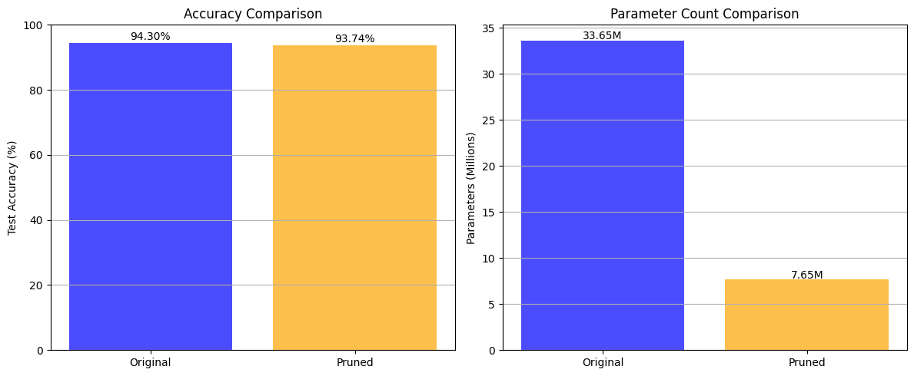
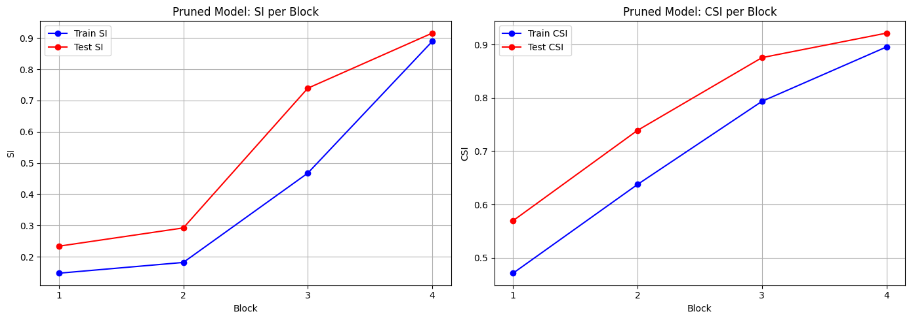
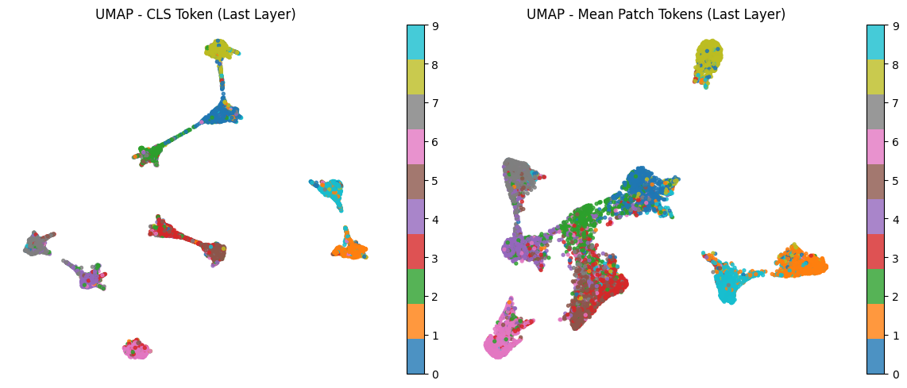
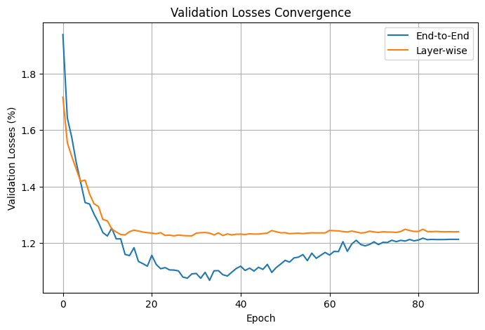

<h1 align="center">
  Deep Network Compression & Vision Transformer Analysis
</h1>

<p align="center">
  <a href="https://pytorch.org/"></a>
  <a href="https://www.python.org/"></a>
  <a href="https://jupyter.org/"></a>
  <a href="https://opensource.org/licenses/MIT"></a>
</p>

<p align="center">
  <strong>Advanced techniques for Deep Neural Network Pruning using Separation Index (SI) and Layer-wise Training of Vision Transformers (ViT) on the CIFAR-10 dataset.</strong>
</p>

---

## 📑 Table of Contents
- [Overview](#-overview)
- [Methodology](#-methodology)
  - [Part 1: CNN Compression (VGG16)](#part-1-cnn-compression-vgg16)
  - [Part 2: Vision Transformer (ViT) Analysis](#part-2-vision-transformer-vit-analysis)
- [Results & Visualizations](#-results--visualizations)
- [Project Structure](#-project-structure)
- [Requirements](#-requirements)
- [Contact](#-contact)

---

##  Overview
This repository contains the implementation and analysis of two advanced concepts in Deep Learning:
1. **Network Compression (Pruning):** Reducing the computational cost and memory footprint of a VGG16 architecture without significant accuracy degradation. This is achieved by evaluating layer importance using the **Separation Index (SI)** and **Center Separation Index (CSI)**, followed by feature pruning via Forward Selection.
2. **Vision Transformers (ViT):** Implementing a ViT from scratch to analyze the discriminative power of its features across different layers. We compare standard **End-to-End (E2E)** training with **Layer-to-Layer (L2L)** training strategies using Cross-SI, Anti-SI metrics, and UMAP dimensionality reduction.

---

##  Methodology

### Part 1: CNN Compression (VGG16)
- **Baseline Training:** A VGG16 model is trained on the CIFAR-10 dataset using specific augmentations (AutoAugment, RandomErasing).
- **Layer Analysis:** Deep features are extracted from intermediate layers and evaluated using SI and CSI.
- **Feature Selection:** Layers with negligible contribution to feature separability are pruned. A *Forward Selection* algorithm is applied to select the most critical features (achieving a ~98% reduction in feature dimension).
- **Fine-Tuning:** A new lightweight classifier is attached to the pruned feature extractor and fine-tuned, resulting in a **77.27% reduction in parameters** with merely a **0.56% drop in accuracy**.

### Part 2: Vision Transformer (ViT) Analysis
- **Architecture:** Implementation of a standard ViT (Patch Embedding, Positional Encoding, Transformer Blocks, MLP Head).
- **End-to-End Training:** The ViT is trained conventionally for 90 epochs.
- **Layer-wise Training:** The network is trained iteratively, adding 2 Transformer blocks per stage (15 epochs per stage) to assess convergence and feature separability at each depth.
- **Evaluation Metrics:** We leverage `UMAP` for 2D visualization of the `[CLS]` and mean patch tokens. Furthermore, **Cross-SI** and **Anti-SI** are calculated to rigorously compare the feature spaces of both training paradigms.

---

## 📊 Results & Visualizations

### VGG16 Pruning & Compression
The pruning process successfully reduced the parameters drastically while maintaining high performance. Below is the comparison between the original and pruned models:

<p align="center">
  
</p>

*Figure 1: Accuracy and Parameter Count Comparison (Original vs. Pruned VGG16).*

<p align="center">
  
</p>

*Figure 2: Separation Index (SI) and Center Separation Index (CSI) tracking across different convolutional blocks.*

### Vision Transformer (ViT) Analysis
UMAP visualization of the final layer tokens demonstrates the network's ability to cluster CIFAR-10 classes:

<p align="center">
  
</p>
*(Note: Replace with your actual UMAP plot saved from the notebook)*

### Training Convergence Comparison (E2E vs Layer-wise)
The comparison of accuracy and loss between End-to-End and Layer-wise training approaches:

<p align="center">
  
</p>
*(Note: Replace with your actual ViT training curve image)*

---

## 📂 Project Structure

```text
├── ANND_CA3_Q1.ipynb      # VGG16 Training, SI/CSI Analysis, and Forward Selection Pruning
├── ANND_CA3_Q2.ipynb      # ViT Implementation, E2E vs Layer-wise Training, UMAP, Cross-SI
├── assets/                # Directory containing plots and images for README
└── README.md              # Project documentation

## Requirements
To run the notebooks, you will need the following Python packages:

bash
torch>=2.0.0
torchvision>=0.15.0
numpy
matplotlib
scikit-learn
umap-learn

It is highly recommended to run these notebooks in an environment with GPU acceleration (e.g., Google Colab T4/A100).

📬 Contact

  GitHub: https://github.com/bhzadjnty7
  Email: behzadjannati@ut.ac.ir / bhzadjnty7@gmail.com
  LinkedIn: https://www.linkedin.com/in/your-linkedin-profile

Behzad Jannati

M.Sc. Student at University of Tehran
